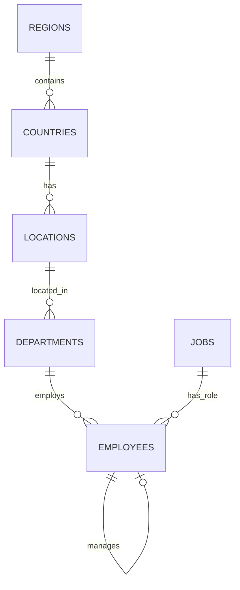

# Ejercicio 2.1: PostgreSQL con Base de Datos HR

> **Estado:** En construcción

---

## Descripción General

Aprenderás a trabajar con **PostgreSQL** usando la base de datos **HR (Human Resources)** de Oracle adaptada.

**Duración estimada:** 4-6 horas
**Nivel:** Intermedio
**Prerequisitos:** SQL básico, haber completado Ejercicio 1.1

---

## Objetivos de Aprendizaje

Al completar este ejercicio serás capaz de:

- ✅ Instalar y configurar PostgreSQL en tu sistema
- ✅ Crear bases de datos y usuarios en PostgreSQL
- ✅ Cargar esquemas y datos desde scripts SQL
- ✅ Realizar consultas complejas con múltiples JOINs
- ✅ Usar funciones específicas de PostgreSQL
- ✅ Comparar sintaxis SQL: Oracle vs PostgreSQL

---

## Base de Datos HR

La BD HR es una base de datos de ejemplo oficial de Oracle que modela un sistema de gestión de recursos humanos.

### Entidades Principales

- **Employees** - Información de empleados
- **Departments** - Departamentos de la empresa
- **Jobs** - Puestos de trabajo
- **Locations** - Ubicaciones geográficas
- **Countries** - Países
- **Regions** - Regiones
- **Job_History** - Historial laboral de empleados

### Diagrama ER Simplificado



---

## Requisitos Técnicos

### Software Necesario

1. **PostgreSQL 14+**
   - [Descargar para Windows](https://www.postgresql.org/download/windows/)
   - [Descargar para Mac](https://www.postgresql.org/download/macosx/)
   - [Descargar para Linux](https://www.postgresql.org/download/linux/)

2. **Cliente SQL (elige uno):**
   - pgAdmin (incluido con PostgreSQL)
   - DBeaver (recomendado para principiantes)
   - VS Code con extensión PostgreSQL

3. **Python (opcional):**
   - psycopg2 para conectar desde Python
   ```bash
   pip install psycopg2-binary
   ```

---

## Contenido del Ejercicio

El ejercicio completo está en:

```
ejercicios/01_bases_de_datos/2.1_postgresql_hr/
```

### Estructura

- `README.md` - Instrucciones detalladas
- `scripts/` - Scripts SQL (a completar por alumnos)
- `soluciones/` - Soluciones de referencia

### Datos

Scripts de la BD HR están en: `datos/oracle_hr/`

---

## Temas Cubiertos

### 1. Instalación y Configuración
- Instalar PostgreSQL
- Crear usuario y base de datos
- Configurar conexión

### 2. Carga de Datos
- Ejecutar scripts DDL (estructura)
- Ejecutar scripts DML (datos)
- Verificar integridad

### 3. Consultas Básicas
- SELECT con filtros
- Ordenamiento y límites
- Funciones de agregación

### 4. Consultas Avanzadas
- JOINs múltiples
- Subconsultas
- CTEs (Common Table Expressions)
- Window Functions

### 5. Análisis de Negocio
- Salarios por departamento
- Jerarquías de empleados
- Historial laboral

---

## Entregas

Consulta las [instrucciones de entrega](../../entregas/01_bases_de_datos/) para saber qué archivos debes subir.

**Carpeta de entrega:**
```
entregas/01_bases_de_datos/tu_apellido_nombre/2.1_postgresql_hr/
```

---

## Recursos de Apoyo

### Documentación Oficial
- [PostgreSQL Documentation](https://www.postgresql.org/docs/)
- [PostgreSQL Tutorial](https://www.postgresqltutorial.com/)

### Tutoriales
- [Guía de Instalación PostgreSQL](https://www.postgresql.org/docs/current/tutorial-install.html)
- [SQL Avanzado en PostgreSQL](https://www.postgresqltutorial.com/postgresql-tutorial/postgresql-cte/)

### Comparativas
- [Oracle vs PostgreSQL - Diferencias de Sintaxis](https://wiki.postgresql.org/wiki/Oracle_to_Postgres_Conversion)

---

## Próximos Pasos

Después de completar este ejercicio:

1. **Ejercicio 2.2** - PostgreSQL Jardinería (más consultas complejas)
2. **Ejercicio 2.3** - Migración de SQLite a PostgreSQL
3. **Ejercicio 3.1** - Oracle con BD HR (comparar con PostgreSQL)

---

**Fecha de publicación:** Por definir
**Última actualización:** 2025-12-17
