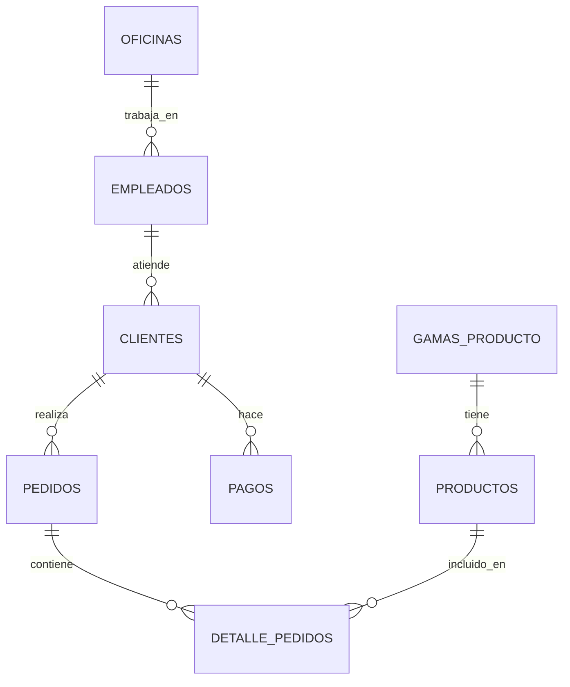

# Ejercicio 2.2: PostgreSQL con Base de Datos Jardinería

> **Estado:** En construcción

---

## Descripción General

Practicarás consultas SQL avanzadas con una base de datos de **gestión de ventas de jardinería**.

**Duración estimada:** 4-6 horas
**Nivel:** Intermedio
**Prerequisitos:** SQL básico, Ejercicio 2.1 (PostgreSQL HR)

---

## Objetivos de Aprendizaje

Al completar este ejercicio serás capaz de:

- ✅ Analizar datos de ventas con SQL
- ✅ Generar reportes de negocio
- ✅ Usar agregaciones complejas (GROUP BY, HAVING)
- ✅ Aplicar Window Functions para rankings y análisis temporal
- ✅ Optimizar consultas con índices
- ✅ Crear vistas materializadas

---

## Base de Datos Jardinería

Base de datos de una empresa que vende productos de jardinería y plantas.

### Entidades Principales

- **Clientes** - Clientes de la empresa
- **Empleados** - Organización y ventas
- **Oficinas** - Ubicaciones de la empresa
- **Pedidos** - Órdenes de compra
- **Detalle_Pedidos** - Líneas de cada pedido
- **Productos** - Catálogo de productos
- **Gamas_Producto** - Categorías
- **Pagos** - Transacciones

### Diagrama ER



---

## Casos de Uso Reales

Este ejercicio simula análisis que harías en una empresa real:

### 1. Análisis de Ventas
- Total de ventas por cliente
- Productos más vendidos
- Evolución de ventas por mes/año

### 2. Gestión de Clientes
- Clientes con mayor volumen de compra
- Clientes inactivos (sin pedidos recientes)
- Distribución geográfica

### 3. Rendimiento de Empleados
- Ventas por empleado
- Clientes asignados por empleado
- Performance por oficina

### 4. Inventario
- Productos con bajo stock
- Análisis de rotación
- Productos sin ventas

---

## Requisitos Técnicos

- PostgreSQL 14+ instalado (del Ejercicio 2.1)
- Cliente SQL (pgAdmin, DBeaver)

---

## Contenido del Ejercicio

El ejercicio completo está en:

```
ejercicios/01_bases_de_datos/2.2_postgresql_jardineria/
```

### Datos

Scripts SQL están en: `datos/jardineria/`

---

## Temas Cubiertos

### 1. Consultas de Análisis
- Agregaciones con GROUP BY
- Filtrado con HAVING
- Múltiples JOINs

### 2. Window Functions
- ROW_NUMBER() para rankings
- LAG/LEAD para comparaciones temporales
- PARTITION BY para análisis por grupo

### 3. Subconsultas
- Subconsultas correlacionadas
- EXISTS / NOT EXISTS
- IN / NOT IN

### 4. Optimización
- EXPLAIN para analizar planes de ejecución
- Creación de índices
- Análisis de rendimiento

### 5. Vistas
- Vistas simples
- Vistas materializadas
- Actualización de vistas

---

## Entregas

Consulta las [instrucciones de entrega](../../entregas/01_bases_de_datos/) para saber qué archivos debes subir.

**Carpeta de entrega:**
```
entregas/01_bases_de_datos/tu_apellido_nombre/2.2_postgresql_jardineria/
```

---

## Recursos de Apoyo

### Documentación
- [PostgreSQL Window Functions](https://www.postgresql.org/docs/current/tutorial-window.html)
- [Query Optimization](https://www.postgresql.org/docs/current/using-explain.html)

### Tutoriales
- [Análisis de Ventas con SQL](https://www.postgresqltutorial.com/)
- [Window Functions Explicadas](https://www.postgresql.org/docs/current/functions-window.html)

---

## Próximos Pasos

Después de completar este ejercicio:

1. **Ejercicio 2.3** - Migración SQLite → PostgreSQL
2. **Ejercicio 3.2** - Oracle Jardinería (comparar implementación)

---

**Fecha de publicación:** Por definir
**Última actualización:** 2025-12-17
