# Fork y Clone

Guia completa para crear tu copia del repositorio y trabajar con ella.

---

## Que es Git? Que es GitHub?

!!! info "Git"
    **Git** = Sistema de control de versiones (como "guardar versiones" de tu codigo)

!!! info "GitHub"
    **GitHub** = Nube donde guardas tu codigo (como Dropbox, pero para codigo)

```mermaid
%%{init: {'theme':'base'}}%%
flowchart TB
    subgraph Local["💻 GIT - Tu Computadora"]
        direction TB
        PC["📁 Carpeta con tu código<br/><br/>├── ejercicio1.py<br/>├── ejercicio2.py<br/>└── .git/ ← Historial local"]
    end

    subgraph Cloud["🌐 GITHUB - Internet (github.com)"]
        direction TB
        Repo["📦 Tu repositorio online<br/><br/>Visible en el navegador<br/>Respaldo en la nube"]
    end

    PC -->|git push<br/>Subir cambios| Cloud
    Cloud -->|git pull<br/>Descargar cambios| PC

    style Local fill:#e8f5e9,stroke:#388e3c,stroke-width:3px
    style Cloud fill:#e1f5ff,stroke:#0277bd,stroke-width:3px
    style PC fill:#fff9c4,stroke:#f57f17,stroke-width:2px
    style Repo fill:#f3e5f5,stroke:#7b1fa2,stroke-width:2px
```



---

## Que es un FORK?

Un **fork** es hacer TU PROPIA COPIA del repositorio del profesor en GitHub.

**Piensalo asi:**

- :books: El profesor tiene un libro (repositorio)
- :page_facing_up: Haces una fotocopia del libro completo (fork)
- :pencil2: Ahora puedes escribir en TU copia sin afectar el original
- :outbox_tray: Cuando termines, le muestras tu trabajo al profesor (Pull Request)

```mermaid
%%{init: {'theme':'base'}}%%
flowchart TD
    subgraph Original["👨‍🏫 REPOSITORIO ORIGINAL (Profesor)"]
        direction TB
        RepoProf["TodoEconometria/ejercicios-bigdata<br/><br/>📁 ejercicio_01/<br/>📁 ejercicio_02/<br/>📁 datos/<br/><br/>🔒 NO puedes modificar directamente"]
    end

    ForkAction{{"🍴 HACER FORK<br/>(Click en botón 'Fork')"}}

    subgraph TuCopia["👤 TU FORK (Tu Copia Personal)"]
        direction TB
        RepoTuyo["TU_USUARIO/ejercicios-bigdata<br/><br/>📁 ejercicio_01/<br/>📁 ejercicio_02/<br/>📁 datos/<br/><br/>✅ Esta copia SÍ puedes modificarla"]
    end

    Original --> ForkAction
    ForkAction -->|Crea una copia<br/>completa e independiente| TuCopia

    style Original fill:#e1f5ff,stroke:#0277bd,stroke-width:3px
    style TuCopia fill:#c8e6c9,stroke:#2e7d32,stroke-width:3px
    style ForkAction fill:#fff9c4,stroke:#f57f17,stroke-width:2px
    style RepoProf fill:#ffebee,stroke:#c62828,stroke-width:2px
    style RepoTuyo fill:#e8f5e9,stroke:#388e3c,stroke-width:2px
```



---

## PASO 1: Hacer Fork del Repositorio

### Instrucciones Paso a Paso

**1. Ir al repositorio del profesor:**

Abre tu navegador y ve a:

```
https://github.com/TodoEconometria/ejercicios-bigdata
```

**2. Hacer Fork (copiar a tu cuenta):**

```
┌─────────────────────────────────────────┐
│  GitHub - Pagina del Repositorio       │
├─────────────────────────────────────────┤
│                                          │
│  [⭐ Star]  [🍴 Fork]  [⬇ Code]        │
│              ↑                           │
│              └── HAZ CLICK AQUI         │
│                                          │
└─────────────────────────────────────────┘
```

- Click en el boton **"Fork"** (arriba a la derecha)
- Selecciona **tu cuenta de GitHub** como destino
- Espera unos segundos mientras GitHub copia todo

**3. Verificar tu fork:**

Ahora deberias estar en TU copia:

```
https://github.com/TU_USUARIO/ejercicios-bigdata
        ↑
        └── Aqui debe aparecer TU nombre de usuario
```

:white_check_mark: **Listo!** Ya tienes tu copia personal del repositorio.

---

## PASO 2: Clonar TU Fork a Tu Computadora

### Que significa "clonar"?

**Clonar** = Descargar todo el codigo de GitHub a tu computadora

```
┌─────────────────────────────────────────┐
│  🌐 GitHub (Tu Fork)                    │
│  https://github.com/TU_USUARIO/...     │
└─────────────────────────────────────────┘
                  │
                  │ git clone (descargar)
                  ↓
┌─────────────────────────────────────────┐
│  💻 Tu PC                                │
│  📁 Carpeta: ejercicios-bigdata/        │
│     ├── ejercicio_01/                   │
│     ├── ejercicio_02/                   │
│     └── datos/                          │
└─────────────────────────────────────────┘
```

### Instrucciones Paso a Paso

**1. Abrir la terminal/cmd:**

=== "Windows"

    Presiona `Win + R`, escribe `cmd`, Enter

=== "macOS"

    Busca "Terminal" en Spotlight (`Cmd + Space`)

=== "Linux"

    Presiona `Ctrl + Alt + T`

**2. Ir a la carpeta donde quieres guardar el proyecto:**

```bash
# Ejemplo: Ir a Documentos
cd Documents

# O crear una carpeta nueva para tus proyectos
mkdir mis-proyectos
cd mis-proyectos
```

**3. Clonar TU fork (reemplaza TU_USUARIO):**

```bash
git clone https://github.com/TU_USUARIO/ejercicios-bigdata.git
```

!!! warning "IMPORTANTE"
    Asegurate de poner **TU nombre de usuario**, no "TodoEconometria"

**4. Entrar a la carpeta:**

```bash
cd ejercicios-bigdata
```

**5. Conectar con el repo original del profesor:**

Esto te permite recibir actualizaciones cuando el profesor agregue ejercicios nuevos:

```bash
git remote add upstream https://github.com/TodoEconometria/ejercicios-bigdata.git
```

**6. Verificar que todo esta bien:**

```bash
git remote -v
```

Deberias ver algo asi:

```
origin    https://github.com/TU_USUARIO/ejercicios-bigdata.git (fetch)
origin    https://github.com/TU_USUARIO/ejercicios-bigdata.git (push)
upstream  https://github.com/TodoEconometria/ejercicios-bigdata.git (fetch)
upstream  https://github.com/TodoEconometria/ejercicios-bigdata.git (push)
```

:white_check_mark: **Listo!** Ya tienes todo el codigo en tu computadora.

---

## Entendiendo origin y upstream

!!! info "origin"
    **origin** = Tu fork en GitHub (donde subes tus cambios)

!!! info "upstream"
    **upstream** = Repositorio original del profesor (de donde descargas actualizaciones)

```mermaid
%%{init: {'theme':'base'}}%%
flowchart TB
    subgraph Upstream["⬆️ UPSTREAM (Profesor)"]
        direction TB
        UP["TodoEconometria/ejercicios-bigdata<br/><br/>✓ Repo original<br/>✓ Solo lectura para ti<br/>✓ Descargas actualizaciones de aquí"]
    end

    subgraph Origin["🌐 ORIGIN (Tu Fork en GitHub)"]
        direction TB
        OR["TU_USUARIO/ejercicios-bigdata<br/><br/>✓ Tu copia en GitHub<br/>✓ Lectura y escritura<br/>✓ Subes tus cambios aquí"]
    end

    subgraph Local["💻 LOCAL (Tu PC)"]
        direction TB
        LOC["ejercicios-bigdata/<br/><br/>✓ Carpeta en tu computadora<br/>✓ Trabajas aquí<br/>✓ Haces commits locales"]
    end

    Upstream -->|"🍴 Fork"| Origin
    Origin -->|"📥 Clone<br/>(git clone)"| Local
    Local -->|"📤 Push<br/>(git push origin)"| Origin
    Upstream -->|"🔄 Fetch<br/>(git fetch upstream)"| Local

    style Upstream fill:#e1f5ff,stroke:#0277bd,stroke-width:3px
    style Origin fill:#fff9c4,stroke:#f57f17,stroke-width:3px
    style Local fill:#e8f5e9,stroke:#388e3c,stroke-width:3px
    style UP fill:#bbdefb,stroke:#1976d2,stroke-width:2px
    style OR fill:#fff59d,stroke:#f9a825,stroke-width:2px
    style LOC fill:#c8e6c9,stroke:#43a047,stroke-width:2px
```



---

## Flujo Completo de Trabajo


---

## Comandos Basicos

### Descargar cambios del profesor

```bash
# Descargar cambios
git fetch upstream

# Aplicar cambios a tu rama main
git checkout main
git merge upstream/main

# Subir a tu fork
git push origin main
```

### Subir tus cambios

```bash
# Ver que cambiaste
git status

# Agregar archivos
git add archivo.py

# Guardar con mensaje
git commit -m "Descripcion del cambio"

# Subir a tu fork
git push origin nombre-de-tu-rama
```

---

## Problemas Comunes

??? question "Error: Permission denied (publickey)"

    **Causa:** No tienes configuradas las SSH keys.

    **Solucion:** Usa HTTPS en lugar de SSH:

    ```bash
    # Usa esta URL (HTTPS):
    git clone https://github.com/TU_USUARIO/ejercicios-bigdata.git

    # NO uses esta (SSH):
    git clone git@github.com:TU_USUARIO/ejercicios-bigdata.git
    ```

??? question "Error: fatal: not a git repository"

    **Causa:** No estas en la carpeta del proyecto.

    **Solucion:**

    ```bash
    # Navega a la carpeta correcta
    cd path/to/ejercicios-bigdata

    # Verifica que estas en la carpeta correcta
    ls -la  # Deberas ver una carpeta .git/
    ```

??? question "Clono el repo del profesor en lugar de mi fork"

    **Causa:** Usaste la URL del profesor.

    **Solucion:**

    1. Borra la carpeta clonada
    2. Haz fork primero en GitHub
    3. Clona TU fork, no el del profesor

    ```bash
    # ❌ MAL
    git clone https://github.com/TodoEconometria/ejercicios-bigdata.git

    # ✅ BIEN
    git clone https://github.com/TU_USUARIO/ejercicios-bigdata.git
    ```

---

## Proximos Pasos

Ahora que tienes el repositorio clonado:

- [Tu Primer Ejercicio](../guia-inicio/primer-ejercicio.md) - Empezar a trabajar
- [Sincronizar Fork](sincronizar-fork.md) - Mantener tu fork actualizado
- [Crear Pull Requests](pull-requests.md) - Entregar tus ejercicios
