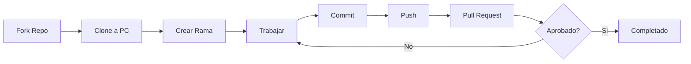

# Git y GitHub

Guias completas para trabajar con Git y GitHub en este curso.

## Que encontraras aqui?

### [Fork y Clone](fork-clone.md)

Aprende a crear tu copia del repositorio y clonarlo a tu computadora:

- Que es un Fork y por que lo necesitas
- Como hacer Fork del repositorio
- Como clonar tu Fork a tu PC
- Configurar remotes (origin y upstream)

### [Sincronizar Fork](sincronizar-fork.md)

Mantener tu Fork actualizado con los ejercicios nuevos del profesor:

- Por que tu Fork NO se actualiza automaticamente
- Como sincronizar desde GitHub Web (facil)
- Como sincronizar desde Terminal (completo)
- Resolver conflictos de merge
- Diagramas visuales del flujo completo

### [Crear Pull Requests](pull-requests.md)

Entregar tus ejercicios al profesor:

- Que es un Pull Request
- Como crear un PR profesional
- Como recibir y aplicar feedback
- Mejores practicas

### [Comandos Utiles](comandos-utiles.md)

Cheatsheet de Git para el dia a dia:

- Comandos basicos
- Comandos avanzados
- Atajos utiles
- Resolver problemas comunes

---

## Flujo de Trabajo Completo



---

## Conceptos Basicos

### Git vs GitHub

!!! info "Git"
    **Git** es un sistema de control de versiones que funciona en tu computadora. Te permite:

    - Guardar versiones de tu codigo
    - Volver a versiones anteriores
    - Trabajar en multiples ramas
    - Colaborar con otros

!!! info "GitHub"
    **GitHub** es una plataforma en la nube donde guardas tu codigo. Te permite:

    - Compartir codigo publicamente
    - Colaborar con otros desarrolladores
    - Alojar proyectos
    - Gestionar Pull Requests

```
┌─────────────────────────────────────────────────────────────┐
│                  GIT vs GITHUB                              │
├─────────────────────────────────────────────────────────────┤
│                                                              │
│  GIT (Programa en tu PC)                                    │
│  ┌──────────────────────────────────────┐                 │
│  │  Tu computadora                       │                 │
│  │  ┌─────────────────────────────────┐ │                 │
│  │  │  📁 Carpeta con tu codigo       │ │                 │
│  │  │  ├── ejercicio1.py              │ │                 │
│  │  │  ├── ejercicio2.py              │ │                 │
│  │  │  └── .git/  ← Historial local  │ │                 │
│  │  └─────────────────────────────────┘ │                 │
│  └──────────────────────────────────────┘                 │
│                      │                                       │
│                      │ git push (subir)                     │
│                      ↓                                       │
│  GITHUB (En Internet)                                       │
│  ┌──────────────────────────────────────┐                 │
│  │  🌐 github.com                        │                 │
│  │  ┌─────────────────────────────────┐ │                 │
│  │  │  📦 Tu repositorio online       │ │                 │
│  │  │  (Visible en el navegador)      │ │                 │
│  │  └─────────────────────────────────┘ │                 │
│  └──────────────────────────────────────┘                 │
│                                                              │
└─────────────────────────────────────────────────────────────┘
```

---

## Primeros Pasos

!!! tip "Nunca usaste Git?"
    Empieza con [Fork y Clone](fork-clone.md) donde te explicamos todo desde cero.

!!! info "Ya tienes el repositorio clonado?"
    Aprende a [Sincronizar tu Fork](sincronizar-fork.md) para obtener ejercicios nuevos.

!!! success "Completaste un ejercicio?"
    Aprende a [Crear Pull Requests](pull-requests.md) para entregarlo.

---

## Ayuda y Recursos

### Problemas Comunes

Consulta la seccion de [Comandos Utiles](comandos-utiles.md) donde encontraras soluciones a problemas frecuentes como:

- "fatal: not a git repository"
- "Your branch is behind origin/main"
- "CONFLICT (content): Merge conflict"
- "Permission denied (publickey)"

### Recursos Externos

- [Git Handbook](https://guides.github.com/introduction/git-handbook/)
- [GitHub Guides](https://guides.github.com/)
- [Atlassian Git Tutorial](https://www.atlassian.com/git/tutorials)
- [Oh Shit, Git!?!](https://ohshitgit.com/) - Para cuando algo sale mal
