# Sincronizar tu Fork

!!! warning "IMPORTANTE"
    Tu fork NO se actualiza automaticamente. Debes sincronizarlo manualmente para obtener los ejercicios nuevos que el profesor agregue.

---

## El Problema

Cuando haces fork, obtienes una **copia en ese momento**. Durante el curso agregare ejercicios nuevos, pero **tu fork NO se actualiza solo**.


https://github.com/TU_USUARIO/ejercicios-bigdata
```

**Paso 2:** Buscar el banner de sincronizacion

Cuando hay cambios nuevos, veras un banner así:

!!! example "Banner en GitHub"
    ```
    ⚠️ This branch is 15 commits behind TodoEconometria:main

    [Sync fork ▼]  ← CLICK AQUI
    ```

**Paso 3:** Click en "Sync fork" → "Update branch"

!!! example "Opciones de sincronización"
    **Sync fork**

    This will update your branch with the latest changes from TodoEconometria:main

    **[Update branch]** ← CLICK AQUI
    [Discard commits]

**Paso 4:** Actualizar tu copia local

Ahora tu fork en GitHub esta actualizado, pero tu PC no. Ejecuta:

```bash
git checkout main
git pull origin main
```

**Paso 5:** Traer cambios a tu rama de trabajo

```bash
# Ve a tu rama de ejercicio
git checkout tu-apellido-ejercicio

# Trae los cambios de main
git merge main

# Sube a GitHub
git push origin tu-apellido-ejercicio
```

:white_check_mark: **Listo!** Tienes los ejercicios nuevos sin perder tu trabajo.

---

## Diagrama Visual del Flujo

### Como funciona la sincronizacion

```mermaid
%%{init: {'theme':'base', 'themeVariables': { 'fontSize':'14px'}}}%%
sequenceDiagram
    actor Tú
    participant Local as 💻 Tu PC<br/>(main: 01, 02)
    participant TuBranch as 💻 Tu PC<br/>(tu-rama: 01, 02 + TU CÓDIGO)
    participant Origin as 🌐 Tu Fork GitHub<br/>(01, 02)
    participant Upstream as 👨‍🏫 Repo Profesor<br/>(01, 02, 03, 04, 05)

    Note over Tú,Upstream: ESTADO INICIAL - Tu fork desactualizado

    rect rgb(255, 243, 224)
    Note over Tú,Upstream: PASO 1: Cambiar a rama main
    Tú->>Local: git checkout main
    activate Local
    Note over Local: Ahora estás en main
    end

    rect rgb(232, 245, 233)
    Note over Tú,Upstream: PASO 2: Descargar y fusionar cambios del profesor
    Tú->>Upstream: git fetch upstream
    Upstream-->>Local: Descarga [03, 04, 05]
    Tú->>Local: git merge upstream/main
    Note over Local: main: 01, 02, 03, 04, 05 ✅
    deactivate Local
    end

    rect rgb(237, 231, 246)
    Note over Tú,Upstream: PASO 3: Cambiar a tu rama de trabajo
    Tú->>TuBranch: git checkout tu-rama
    activate TuBranch
    Note over TuBranch: Ahora estás en tu-rama
    end

    rect rgb(255, 249, 196)
    Note over Tú,Upstream: PASO 4: Traer cambios a tu rama
    Tú->>TuBranch: git merge main
    Note over TuBranch: tu-rama: 01-05 + TU CÓDIGO ✅
    deactivate TuBranch
    end

    rect rgb(225, 245, 254)
    Note over Tú,Upstream: PASO 5: Subir todo a GitHub
    Tú->>Origin: git push origin tu-rama
    Note over Origin: tu-rama: 01-05 + TU CÓDIGO ✅
    end

    rect rgb(200, 230, 201)
    Note over Tú,Upstream: ✅ RESULTADO - Tienes todo sin perder tu trabajo
    end
```



---

## Vista Simplificada del Proceso

```mermaid
%%{init: {'theme':'base', 'themeVariables': { 'primaryColor':'#e1f5ff','primaryTextColor':'#000','primaryBorderColor':'#0277bd','secondaryColor':'#fff9c4','tertiaryColor':'#e8f5e9','noteBkgColor':'#fff3e0','noteTextColor':'#000'}}}%%
flowchart TB
    subgraph Antes["❌ ANTES - Desactualizado"]
        direction LR
        A1["👨‍🏫 Repo Profesor<br/><br/>📦 Ejercicios:<br/>[01] [02] [03] [04] [05]"]
        A2["🌐 Tu Fork<br/><br/>📦 Tus ejercicios:<br/>[01] [02]<br/><br/>⚠️ Te faltan 3 ejercicios"]
        A3["💻 Tu PC<br/><br/>📂 tu-rama:<br/>[01] [02] + TU CÓDIGO"]
    end

    subgraph Proceso["🔄 PROCESO DE SINCRONIZACIÓN"]
        direction TB
        P1["① git fetch upstream<br/>Descargar cambios del profesor"]
        P2["② git merge upstream/main<br/>Aplicar a tu main local"]
        P3["③ git merge main<br/>Traer a tu rama de trabajo"]
        P4["④ git push origin tu-rama<br/>Subir todo a GitHub"]

        P1 --> P2 --> P3 --> P4
    end

    subgraph Despues["✅ DESPUÉS - Actualizado"]
        direction LR
        D1["👨‍🏫 Repo Profesor<br/><br/>📦 Ejercicios:<br/>[01] [02] [03] [04] [05]"]
        D2["🌐 Tu Fork<br/><br/>📦 Tus ejercicios:<br/>[01-05] + TU CÓDIGO<br/><br/>✅ Completamente actualizado"]
        D3["💻 Tu PC<br/><br/>📂 tu-rama:<br/>[01-05] + TU CÓDIGO<br/><br/>🎯 Listo para trabajar"]
    end

    Antes --> Proceso --> Despues

    style A1 fill:#e1f5ff,stroke:#0277bd,stroke-width:2px
    style A2 fill:#ffebee,stroke:#c62828,stroke-width:2px
    style A3 fill:#fff3e0,stroke:#ef6c00,stroke-width:2px

    style P1 fill:#e3f2fd,stroke:#1976d2,stroke-width:2px
    style P2 fill:#e8f5e9,stroke:#388e3c,stroke-width:2px
    style P3 fill:#f3e5f5,stroke:#7b1fa2,stroke-width:2px
    style P4 fill:#fff9c4,stroke:#f57f17,stroke-width:2px

    style D1 fill:#e1f5ff,stroke:#0277bd,stroke-width:2px
    style D2 fill:#c8e6c9,stroke:#2e7d32,stroke-width:3px
    style D3 fill:#c8e6c9,stroke:#2e7d32,stroke-width:3px
```



---

## Metodo Detallado (Terminal)

### Situacion

Trabajas en una rama (ejemplo: `garcia-ejercicio-1.1`) y el profesor agrego ejercicios nuevos.

**Objetivo:** Traer los ejercicios nuevos SIN perder tu trabajo.

### PASO 1: Guarda tu trabajo actual

```bash
# Ver que archivos cambiaste
git status

# Guardar tus cambios
git add entregas/1.1_sqlite/tu_apellido_nombre/
git commit -m "Guardar mi avance"
```

### PASO 2: Ve a tu rama main

```bash
git checkout main
```

### PASO 3: Descarga los cambios del profesor

```bash
git fetch upstream
git merge upstream/main
```

Ahora tu `main` local tiene los ejercicios nuevos :white_check_mark:

### PASO 4: Vuelve a tu rama de trabajo

```bash
git checkout garcia-ejercicio-1.1
```

(Reemplaza `garcia-ejercicio-1.1` por el nombre de TU rama)

### PASO 5: Trae los ejercicios nuevos a tu rama

```bash
git merge main
```

!!! info "Que hace esto?"
    Combina los ejercicios nuevos del profesor con tu trabajo. **NO borra nada tuyo.**

### PASO 6: Sube a GitHub

```bash
git push origin garcia-ejercicio-1.1
```

:white_check_mark: **Listo!** Tienes los ejercicios nuevos Y tu trabajo intacto.

---

## Que Pasa Cuando el Profesor Agrega Ejercicios?

```mermaid
%%{init: {'theme':'base', 'themeVariables': { 'git0':'#e1f5ff','git1':'#fff9c4','git2':'#ffebee'}}}%%
gitGraph
    commit id: "01: Intro SQLite" tag: "Semana 1"
    commit id: "02: Limpieza Datos"
    branch tu-fork
    checkout tu-fork
    commit id: "✅ Hiciste Fork" type: HIGHLIGHT

    checkout main
    commit id: "03: Dask & Parquet" tag: "Semana 3"
    commit id: "04: PySpark"
    commit id: "05: Dashboard"

    checkout tu-fork
    commit id: "❌ Desactualizado" type: REVERSE
    commit id: "⚠️ Te faltan 03, 04, 05" type: REVERSE
```



!!! warning "El fork NO se actualiza automáticamente"
    Cuando el profesor agrega ejercicios nuevos al repositorio original, **tu fork en GitHub NO recibe esos cambios automáticamente**. Debes sincronizarlo manualmente siguiendo los pasos de esta guía.

---

## Regla de Oro para Evitar Problemas

```mermaid
%%{init: {'theme':'base'}}%%
flowchart LR
    subgraph Bien["✅ BIEN - Edita solo aquí"]
        direction TB
        B1["📁 entregas/1.1_sqlite/tu_apellido_nombre/<br/><br/>├── ANALISIS_DATOS.md<br/>├── resumen_eda.md<br/>└── REFLEXION.md<br/><br/>✅ Aquí haces tus cambios"]
    end

    subgraph Mal["❌ MAL - NO toques esto"]
        direction TB
        M1["📁 ejercicios/01_bases_de_datos/<br/><br/>├── README.md ← NO TOCAR<br/>├── eda_exploratorio.py ← Solo ejecutar<br/><br/>🔒 Archivos del profesor"]
    end

    Bien -.->|Sin conflictos| OK["🎉 Sincronización<br/>perfecta"]
    Mal -.->|Causa conflictos| NOK["⚠️ Problemas<br/>al sincronizar"]

    style Bien fill:#c8e6c9,stroke:#2e7d32,stroke-width:3px
    style Mal fill:#ffcdd2,stroke:#c62828,stroke-width:3px
    style B1 fill:#e8f5e9,stroke:#388e3c,stroke-width:2px
    style M1 fill:#ffebee,stroke:#d32f2f,stroke-width:2px
    style OK fill:#a5d6a7,stroke:#43a047,stroke-width:2px
    style NOK fill:#ef9a9a,stroke:#e53935,stroke-width:2px
```



!!! success "Regla de Oro"
    **Si solo editas archivos en `entregas/TU_CARPETA/`, NUNCA tendrás conflictos.**

    El profesor actualiza `ejercicios/`, tú trabajas en `entregas/`. Cero problemas.

---

## Que hago si Git dice "CONFLICT"?

### Paso 1: Git te dira que archivo tiene conflicto

```bash
Auto-merging ejercicio_01.py
CONFLICT (content): Merge conflict in ejercicio_01.py
Automatic merge failed; fix conflicts and then commit the result.
```

### Paso 2: Abre el archivo

Veras algo asi:

```python
<<<<<<< HEAD
tu codigo aqui
=======
codigo del profesor
>>>>>>> main
```

### Paso 3: Decide que mantener

- Si es un archivo del profesor que NO deberias tocar → Mantén la version del profesor
- Si es TU archivo de entrega → Mantén tu version

### Paso 4: Borra las marcas

Elimina estas lineas:

```
<<<<<<< HEAD
=======
>>>>>>> main
```

### Paso 5: Termina el merge

```bash
git add nombre-del-archivo
git commit -m "Resolver conflicto"
git push origin tu-rama
```

!!! tip "Consejo"
    Si trabajas solo en `entregas/TU_CARPETA/`, esto nunca te pasara.

---

## Resumen Ultra-Rapido

```bash
# 1. Guardar tu trabajo
git add .
git commit -m "Guardar avance"

# 2. Actualizar main
git checkout main
git fetch upstream
git merge upstream/main

# 3. Volver a tu rama y traer cambios
git checkout tu-rama
git merge main

# 4. Subir
git push origin tu-rama
```

**Frecuencia:** Haz esto cada lunes antes de clase.

---

## Buenas Practicas de Sincronizacion

### 1. Sincroniza ANTES de empezar un ejercicio nuevo

```bash
# ✅ BIEN - Sincronizar primero
git fetch upstream && git merge upstream/main
# Ahora empieza a trabajar

# ❌ MAL - Trabajar con codigo viejo
# Empiezas sin actualizar, luego tienes conflictos
```

### 2. Haz un commit de tu trabajo ANTES de sincronizar

```bash
# ✅ BIEN - Guarda tu trabajo primero
git add .
git commit -m "Avance en ejercicio 03"
git fetch upstream && git merge upstream/main

# ❌ MAL - Sincronizar con cambios sin guardar
# Puedes perder tu trabajo
```

### 3. Frecuencia recomendada

```mermaid
%%{init: {'theme':'base'}}%%
gantt
    title 📅 Calendario de Sincronización Semanal
    dateFormat YYYY-MM-DD
    section Lunes
    Sincronizar antes de clase :milestone, m1, 2024-01-01, 0d
    git fetch upstream :active, 2024-01-01, 1h
    git merge upstream/main :active, 2024-01-01, 30m
    section Martes a Jueves
    Trabajar en ejercicios :2024-01-02, 3d
    Commits locales :2024-01-02, 3d
    section Viernes
    Push de tu avance :milestone, m2, 2024-01-05, 0d
    git push origin tu-rama :crit, 2024-01-05, 1h
    section Domingo
    Verificar actualizaciones (opcional) :done, 2024-01-07, 30m
```



!!! tip "Recomendación de frecuencia"
    - **Lunes**: Sincroniza antes de clase para tener los últimos ejercicios
    - **Durante la semana**: Trabaja normalmente, haz commits frecuentes
    - **Viernes**: Sube tu avance a GitHub
    - **Domingo (opcional)**: Verifica si hay actualizaciones nuevas

---

## Verificar Estado de Sincronizacion

### Comando util para saber si estas desactualizado

```bash
# Ver diferencias entre tu fork y el repo del profesor
git fetch upstream
git log HEAD..upstream/main --oneline
```

**Si ves commits nuevos:**

```
a1b2c3d Agregar ejercicio 06
d4e5f6g Corregir typo en ejercicio 05
g7h8i9j Agregar datos para ejercicio 06
```

Significa que tienes 3 commits (ejercicios/actualizaciones) que no tienes.

**Si no ves nada:**

```
(vacio)
```

Significa que estas actualizado. :white_check_mark:

---

## Proximos Pasos

Ahora que sabes como sincronizar tu fork:

- [Crear Pull Requests](pull-requests.md) - Entregar tus ejercicios
- [Comandos Utiles](comandos-utiles.md) - Cheatsheet de Git
- [Fork y Clone](fork-clone.md) - Si necesitas repasar los conceptos basicos
