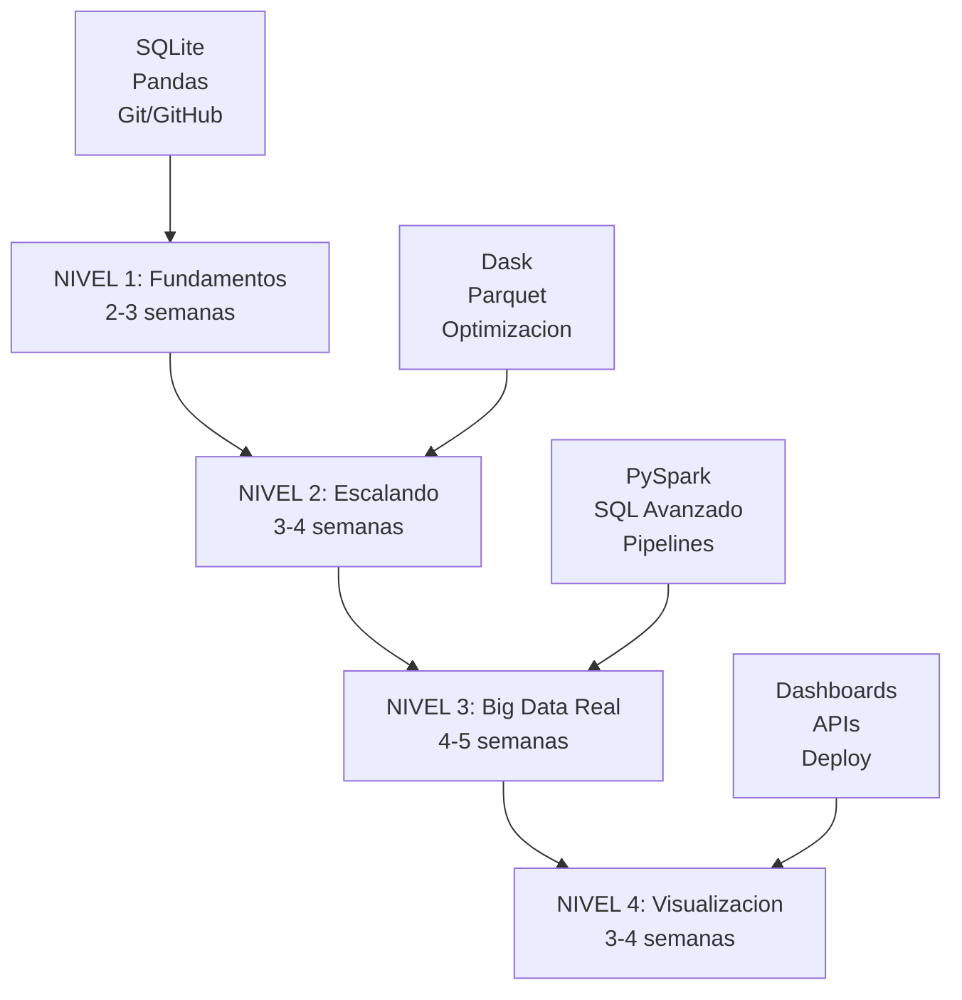
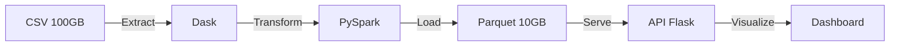
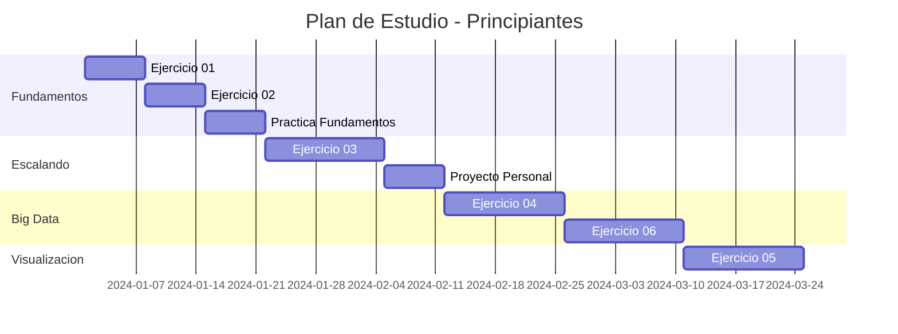
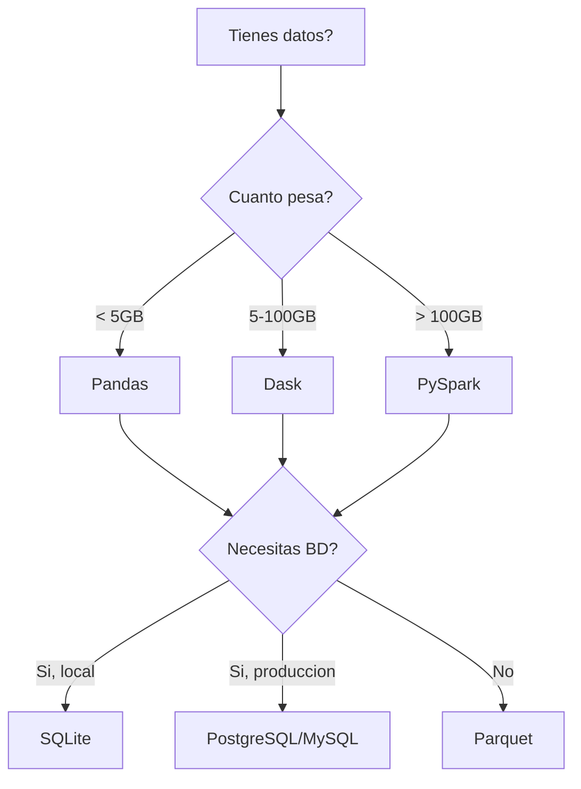

# Roadmap del Curso

Vision completa de todos los ejercicios, tecnologias y el plan de aprendizaje recomendado.

## Niveles de Aprendizaje



---

## NIVEL 1: Fundamentos

**Duracion:** 2-3 semanas | **Dificultad:** 🟢 Basico

### Objetivos

- Dominar las bases de datos relacionales con SQLite
- Aprender analisis de datos con Pandas
- Entender control de versiones con Git/GitHub

### Tecnologias

| Tecnologia | Proposito | Recursos |
|------------|-----------|----------|
| **SQLite** | Base de datos embebida | [Docs oficiales](https://www.sqlite.org/) |
| **Pandas** | Analisis de datos en memoria | [Pandas docs](https://pandas.pydata.org/) |
| **Git** | Control de versiones | [Git handbook](https://guides.github.com/) |

### Ejercicios

#### Ejercicio 01: Carga de Datos con SQLite

!!! info "Detalles"
    - **Tiempo estimado:** 2-3 horas
    - **Dataset:** NYC Taxi (10MB muestra)
    - **Nivel:** 🟢 Basico

**Que aprenderas:**

- Cargar datos desde CSV a base de datos
- Queries SQL basicas (SELECT, WHERE, GROUP BY)
- Optimizacion con indices
- Exportar resultados

**Habilidades:**

- [x] Cargar CSV en chunks
- [x] Crear base de datos SQLite
- [x] Ejecutar queries SQL
- [x] Crear indices
- [x] Exportar resultados a CSV

#### Ejercicio 02: Limpieza y Transformacion

!!! info "Detalles"
    - **Tiempo estimado:** 3-4 horas
    - **Dataset:** NYC Taxi (datos sucios)
    - **Nivel:** 🟢 Basico

**Que aprenderas:**

- Detectar y manejar valores nulos
- Identificar outliers
- Transformaciones de datos
- Validacion de tipos

---

## NIVEL 2: Escalando

**Duracion:** 3-4 semanas | **Dificultad:** 🟡 Intermedio

### Objetivos

- Procesar datos mas grandes que tu RAM
- Entender procesamiento paralelo
- Optimizar rendimiento

### Tecnologias

| Tecnologia | Proposito | Cuando Usarla |
|------------|-----------|---------------|
| **Dask** | Procesamiento paralelo | Datos > RAM (5-100GB) |
| **Parquet** | Formato columnar | Almacenamiento eficiente |
| **Optimizacion** | Performance | Siempre |

### Ejercicios

#### Ejercicio 03: Procesamiento con Parquet y Dask

!!! info "Detalles"
    - **Tiempo estimado:** 4-5 horas
    - **Dataset:** NYC Taxi completo (121MB)
    - **Nivel:** 🟡 Intermedio

**Que aprenderas:**

- Por que Parquet es mejor que CSV
- Procesamiento paralelo con Dask
- Lazy evaluation
- Optimizacion de memoria

**Comparativa de Formatos:**

| Metrica | CSV | Parquet |
|---------|-----|---------|
| Tamano en disco | 121 MB | 45 MB |
| Tiempo de lectura | 8.5 seg | 1.2 seg |
| Compresion | No | Si |
| Tipos de datos | No preserva | Si preserva |

---

## NIVEL 3: Big Data Real

**Duracion:** 4-5 semanas | **Dificultad:** 🔴 Avanzado

### Objetivos

- Dominar procesamiento distribuido
- Trabajar con datos masivos (>100GB)
- Construir pipelines de produccion

### Tecnologias

| Tecnologia | Proposito | Escala |
|------------|-----------|--------|
| **PySpark** | Procesamiento distribuido | > 100GB |
| **SQL Avanzado** | Queries complejas | Cualquier tamano |
| **Pipelines ETL** | Automatizacion | Produccion |

### Ejercicios

#### Ejercicio 04: Queries Complejas con PySpark

!!! info "Detalles"
    - **Tiempo estimado:** 5-6 horas
    - **Dataset:** NYC Taxi + Weather (multiple fuentes)
    - **Nivel:** 🔴 Avanzado

**Que aprenderas:**

- Introduccion a Spark
- DataFrames distribuidos
- SQL en Spark
- Joins de multiples fuentes
- Particionamiento de datos

#### Ejercicio 06: Pipeline ETL Completo

!!! info "Detalles"
    - **Tiempo estimado:** 10-12 horas
    - **Dataset:** Multiples fuentes
    - **Nivel:** 🔴 Avanzado

**Arquitectura del Pipeline:**



---

## NIVEL 4: Visualizacion y Deploy

**Duracion:** 3-4 semanas | **Dificultad:** 🔴 Avanzado

### Objetivos

- Crear dashboards profesionales
- Servir datos via API
- Deploy a produccion

### Tecnologias

| Tecnologia | Proposito | Uso |
|------------|-----------|-----|
| **Flask** | Backend web | APIs y dashboards |
| **Chart.js** | Visualizaciones | Graficos interactivos |
| **Docker** | Contenedores | Deploy |

### Ejercicios

#### Ejercicio 05: Dashboard Interactivo

!!! info "Detalles"
    - **Tiempo estimado:** 8-10 horas
    - **Proyecto:** Dashboard EDA NYC Taxi
    - **Nivel:** 🔴 Avanzado

**Funcionalidades:**

- :bar_chart: Visualizacion de 10M+ registros
- :calendar: Filtros dinamicos por fecha/hora
- :world_map: Mapas de calor
- :chart_with_upwards_trend: Analisis de tendencias

**Tech Stack:**

```
Frontend: HTML + Bootstrap + Chart.js
Backend:  Flask + Pandas/Dask
Data:     SQLite/Parquet
Deploy:   Docker
```

---

## Plan de Estudio Recomendado

### Para Principiantes (10-12 semanas)



**Dedicacion:** 10-15 horas/semana

### Para Intermedios (6-8 semanas)

!!! tip "Recomendacion"
    Si ya conoces Python y Pandas, puedes empezar directamente en el NIVEL 2.

**Dedicacion:** 8-10 horas/semana

### Para Avanzados (4-5 semanas)

!!! tip "Recomendacion"
    Si ya trabajaste con Big Data, enfocate en los ejercicios de PySpark y el proyecto final.

**Dedicacion:** 5-8 horas/semana

---

## Tecnologias por Ejercicio

| Ejercicio | SQLite | Pandas | Dask | PySpark | Flask | Nivel |
|-----------|--------|--------|------|---------|-------|-------|
| 01 - SQLite | ✅ | ✅ | - | - | - | 🟢 |
| 02 - Limpieza | - | ✅ | - | - | - | 🟢 |
| 03 - Dask | - | ✅ | ✅ | - | - | 🟡 |
| 04 - PySpark | - | - | ✅ | ✅ | - | 🔴 |
| 05 - Dashboard | ✅ | ✅ | - | - | ✅ | 🔴 |
| 06 - Pipeline | - | - | ✅ | ✅ | ✅ | 🔴 |

---

## Comparativa de Tecnologias

### Cuando usar cada herramienta?



### Tabla Comparativa

| Tamano de Datos | Herramienta | Tiempo de Procesamiento | RAM Necesaria |
|-----------------|-------------|-------------------------|---------------|
| < 1GB | Pandas | Segundos | 2-4x tamano datos |
| 1-5GB | Pandas | Minutos | 2-4x tamano datos |
| 5-50GB | Dask | Minutos | Cualquier RAM |
| 50-500GB | Dask/PySpark | Minutos-Horas | Cualquier RAM |
| > 500GB | PySpark | Horas | Cluster |

---

## Certificacion y Evaluacion

### Para Alumnos del Curso Presencial

- :white_check_mark: Certificado de 230 horas
- :white_check_mark: Evaluacion continua via Pull Requests
- :white_check_mark: Proyecto final integrador
- :white_check_mark: Soporte directo del instructor

### Para Autodidactas

- :white_check_mark: Portfolio de proyectos en GitHub
- :white_check_mark: Codigo revisable por empleadores
- :white_check_mark: Experiencia con datos reales
- :white_check_mark: Aprendizaje a tu ritmo

!!! tip "Tu GitHub es tu Certificado"
    Los empleadores valoran mas ver tu codigo y proyectos que un PDF. Asegurate de:

    - Hacer commits claros y profesionales
    - Documentar tu codigo
    - Completar los ejercicios con calidad
    - Agregar un README personalizado a tu fork

---

## Recursos Adicionales

### Documentacion Oficial

- [Pandas Documentation](https://pandas.pydata.org/docs/)
- [Dask Documentation](https://docs.dask.org/)
- [PySpark Documentation](https://spark.apache.org/docs/latest/api/python/)
- [SQLite Tutorial](https://www.sqlitetutorial.net/)

### Cursos Complementarios

- [Python for Data Science](https://www.coursera.org/specializations/python)
- [Big Data with Spark](https://www.udacity.com/course/learn-spark-at-udacity--ud2002)
- [SQL for Data Science](https://www.datacamp.com/courses/intro-to-sql-for-data-science)

### Comunidades

- [r/datascience](https://www.reddit.com/r/datascience/)
- [Stack Overflow - pandas](https://stackoverflow.com/questions/tagged/pandas)
- [Dask Discourse](https://dask.discourse.group/)

---

## Proximos Pasos

Ahora que conoces el roadmap completo:

1. [Instalar Herramientas](instalacion.md) - Si aun no las tienes
2. [Tu Primer Ejercicio](primer-ejercicio.md) - Empezar a practicar
3. [Fork y Clone](../git-github/fork-clone.md) - Configurar tu entorno de trabajo
