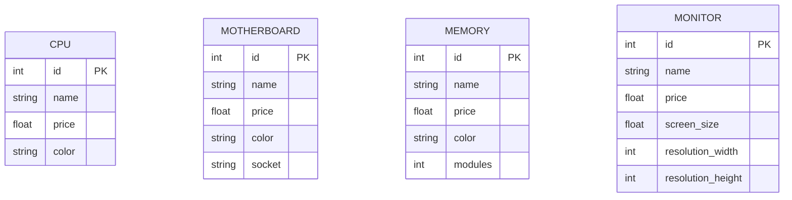
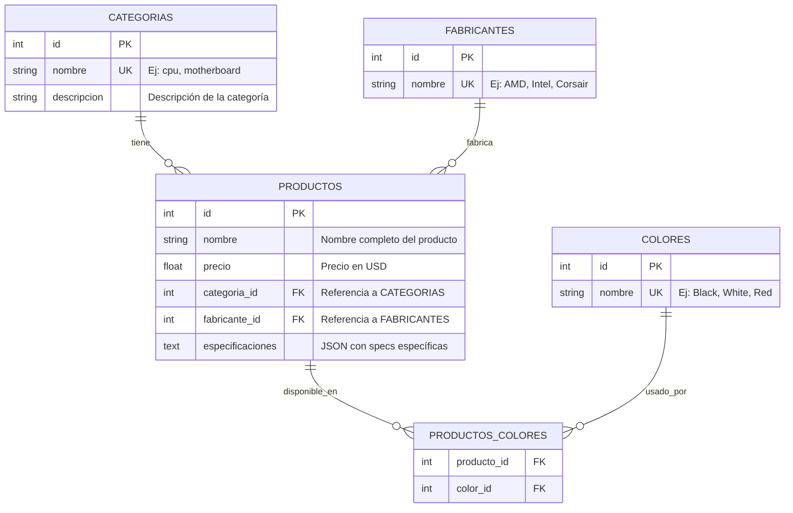

# Análisis Exploratorio de Datos - Tienda de Componentes Informáticos

**Ejercicio:** 1.1 - Introducción a SQLite
**Autor:** [Tu nombre]
**Fecha:** 2025-12-15

---

## 1. Resumen Ejecutivo

> **Instrucciones:** Completa esta sección después de ejecutar `eda_exploratorio.py`

### Estadísticas Generales

- **Archivos CSV analizados:** [COMPLETAR]
- **Total de productos (filas):** [COMPLETAR]
- **Categorías diferentes:** [COMPLETAR]
- **Fabricantes únicos identificados:** [COMPLETAR]
- **Colores únicos identificados:** [COMPLETAR]

### Observaciones Iniciales

[Escribe aquí tus primeras observaciones al ver los datos]

Ejemplo:
- La mayoría de archivos tienen entre 50-200 productos
- Todos los archivos tienen columnas 'name' y 'price'
- Algunos archivos tienen columna 'color', otros no
- etc.

---

## 2. Análisis de Estructura

### 2.1 Columnas Comunes

Columnas que aparecen en **TODOS** los archivos CSV:

- [COMPLETAR - Listar columnas comunes]

Ejemplo:
- `name` - Nombre del producto
- `price` - Precio
- etc.

### 2.2 Columnas Específicas por Categoría

Columnas que solo aparecen en ciertos tipos de productos:

| Categoría | Columnas Específicas |
|-----------|---------------------|
| cpu.csv | [COMPLETAR] |
| motherboard.csv | [COMPLETAR] |
| memory.csv | [COMPLETAR] |
| ... | ... |

### 2.3 Tabla Resumen de Archivos

| Archivo | Número de Filas | Número de Columnas |
|---------|----------------:|-------------------:|
| [COMPLETAR] | [COMPLETAR] | [COMPLETAR] |
| ... | ... | ... |

> **Fuente:** Copia los datos del archivo `resumen_eda.txt` generado por el script

---

## 3. Análisis de Calidad de Datos

### 3.1 Valores Nulos

**Archivos con valores nulos:**

| Archivo | Columna | Cantidad Nulos | Porcentaje |
|---------|---------|---------------:|----------:|
| [COMPLETAR] | [COMPLETAR] | [COMPLETAR] | [COMPLETAR]% |

**Interpretación:**
[Explica qué significan estos valores nulos y si son problemáticos]

### 3.2 Duplicados

**Archivos con filas duplicadas:**

| Archivo | Filas Duplicadas |
|---------|----------------:|
| [COMPLETAR] | [COMPLETAR] |

**Interpretación:**
[Explica si esto es esperado o un problema de calidad]

### 3.3 Rangos de Precios

**Análisis de precios por categoría:**

| Categoría | Precio Mínimo | Precio Máximo | Precio Promedio |
|-----------|-------------:|-------------:|---------------:|
| [COMPLETAR] | $[COMPLETAR] | $[COMPLETAR] | $[COMPLETAR] |

**Observaciones:**
- ¿Los precios tienen sentido?
- ¿Hay valores negativos o ceros?
- ¿Hay outliers (precios extremadamente altos/bajos)?

---

## 4. Identificación de Entidades

### 4.1 Categorías

Basado en los nombres de archivos, identificamos las siguientes categorías:

1. [COMPLETAR - Listar todas las categorías]
2. ...

**Total:** [X] categorías

### 4.2 Fabricantes

Fabricantes únicos extraídos de los nombres de productos:

[COMPLETAR - Listar fabricantes]

Ejemplos:
- AMD
- Intel
- Corsair
- ASUS
- etc.

**Total:** [X] fabricantes

**Método de extracción:**
[Explica cómo identificaste los fabricantes. Ej: "Primera palabra del nombre del producto"]

### 4.3 Colores

Colores únicos encontrados en los productos:

[COMPLETAR - Listar colores si existen]

**Total:** [X] colores

---

## 5. Diagramas Entidad-Relación

### 5.1 Diagrama ER - Modelo A (Desnormalizado)

**Descripción:**
El Modelo A es la representación más simple: cada archivo CSV se convierte en una tabla independiente. No hay relaciones entre tablas.



**Características:**
- ✅ **Ventaja:** Muy fácil de implementar (mapeo directo CSV → tabla)
- ✅ **Ventaja:** Preserva todas las columnas específicas de cada categoría
- ❌ **Desventaja:** Mucha redundancia (fabricantes duplicados)
- ❌ **Desventaja:** Imposible hacer consultas entre categorías fácilmente
- ❌ **Desventaja:** Si quiero agregar una columna común (ej: "descuento"), tengo que modificar 26 tablas

**Justificación:**
[Explica por qué este modelo es simple pero ineficiente para un sistema real]

---

### 5.2 Diagrama ER - Modelo B (Normalizado 3NF)

**Descripción:**
El Modelo B normaliza los datos para eliminar redundancia. Crea tablas para entidades comunes (categorías, fabricantes, colores) y establece relaciones mediante Foreign Keys.



**Características:**
- ✅ **Ventaja:** Elimina redundancia (fabricantes almacenados una sola vez)
- ✅ **Ventaja:** Fácil agregar columnas comunes (solo modificar tabla PRODUCTOS)
- ✅ **Ventaja:** Consultas entre categorías son simples (JOIN)
- ✅ **Ventaja:** Integridad referencial (FKs garantizan consistencia)
- ❌ **Desventaja:** Más complejo de implementar
- ❌ **Desventaja:** Requiere JOINs para obtener datos completos

**Relaciones identificadas:**

1. **CATEGORIAS → PRODUCTOS (1:N)**
   - Una categoría tiene muchos productos
   - Un producto pertenece a una sola categoría

2. **FABRICANTES → PRODUCTOS (1:N)**
   - Un fabricante fabrica muchos productos
   - Un producto tiene un solo fabricante

3. **PRODUCTOS ↔ COLORES (M:N)**
   - Un producto puede tener varios colores
   - Un color puede estar en varios productos
   - Se resuelve con tabla intermedia PRODUCTOS_COLORES

**Justificación:**
[Explica por qué este modelo es mejor para sistemas de producción]

---

### 5.3 Diagrama ER - Modelo C (E-Commerce Completo)

**Descripción:**
El Modelo C extiende el Modelo B agregando funcionalidad de comercio electrónico: clientes, pedidos, carritos e inventario.

```mermaid
erDiagram
    %% Entidades del catálogo (Modelo B)
    CATEGORIAS {
        int id PK
        string nombre UK
        string descripcion
    }

    FABRICANTES {
        int id PK
        string nombre UK
    }

    PRODUCTOS {
        int id PK
        string nombre
        float precio
        int categoria_id FK
        int fabricante_id FK
        text especificaciones
    }

    %% Entidades de E-Commerce
    CLIENTES {
        int id PK
        string email UK
        string nombre
        string apellido
        string telefono
        datetime fecha_registro
    }

    PEDIDOS {
        int id PK
        int cliente_id FK
        datetime fecha
        float total
        string estado "pending, completed, cancelled"
        string direccion_envio
    }

    LINEAS_PEDIDO {
        int id PK
        int pedido_id FK
        int producto_id FK
        int cantidad
        float precio_unitario "Precio al momento de compra"
        float subtotal
    }

    INVENTARIO {
        int producto_id PK_FK
        int stock_actual
        int stock_minimo
        datetime ultima_actualizacion
    }

    CARRITOS {
        int id PK
        int cliente_id FK
        datetime fecha_creacion
        datetime fecha_modificacion
    }

    ITEMS_CARRITO {
        int id PK
        int carrito_id FK
        int producto_id FK
        int cantidad
    }

    %% Relaciones del catálogo
    CATEGORIAS ||--o{ PRODUCTOS : "tiene"
    FABRICANTES ||--o{ PRODUCTOS : "fabrica"

    %% Relaciones de E-Commerce
    CLIENTES ||--o{ PEDIDOS : "realiza"
    CLIENTES ||--o| CARRITOS : "tiene_activo"
    PEDIDOS ||--o{ LINEAS_PEDIDO : "contiene"
    PRODUCTOS ||--o{ LINEAS_PEDIDO : "incluido_en"
    PRODUCTOS ||--|| INVENTARIO : "tiene_stock"
    CARRITOS ||--o{ ITEMS_CARRITO : "contiene"
    PRODUCTOS ||--o{ ITEMS_CARRITO : "añadido_a"
```

**Nuevas Entidades:**

1. **CLIENTES**
   - Usuarios registrados en el sistema
   - Email como identificador único

2. **PEDIDOS**
   - Compras completadas o en proceso
   - Vinculados a un cliente
   - Estado del pedido (pendiente, completado, cancelado)

3. **LINEAS_PEDIDO**
   - Detalle de productos en cada pedido
   - Almacena precio_unitario al momento de compra (importante porque los precios pueden cambiar)

4. **INVENTARIO**
   - Control de stock por producto
   - Stock actual y stock mínimo (para alertas)

5. **CARRITOS**
   - Compras pendientes/en proceso
   - Cada cliente tiene un carrito activo

6. **ITEMS_CARRITO**
   - Productos agregados al carrito
   - Similar a LINEAS_PEDIDO pero para carrito activo

**Características:**
- ✅ **Ventaja:** Sistema completo de e-commerce
- ✅ **Ventaja:** Historial de compras (auditoría)
- ✅ **Ventaja:** Control de inventario
- ✅ **Ventaja:** Carritos persistentes
- ❌ **Desventaja:** Mayor complejidad
- ❌ **Desventaja:** Más tablas que mantener

**Justificación:**
[Explica cuándo es necesario este nivel de detalle]

---

## 6. Conclusiones para el Diseño

### 6.1 Comparación de Modelos

| Aspecto | Modelo A | Modelo B | Modelo C |
|---------|----------|----------|----------|
| **Complejidad** | Baja | Media | Alta |
| **Redundancia** | Alta | Baja | Baja |
| **Mantenibilidad** | Difícil | Fácil | Media |
| **Casos de uso** | Análisis rápido | Catálogo | E-Commerce completo |
| **Número de tablas** | 26 | ~5-8 | ~12-15 |

### 6.2 Decisiones de Diseño

**¿Cuándo usar Modelo A?**
[COMPLETAR - Tus conclusiones]

Ejemplo:
- Para análisis exploratorio rápido
- Cuando los datos vienen de fuentes externas y no se van a modificar
- Prototipado rápido

**¿Cuándo usar Modelo B?**
[COMPLETAR - Tus conclusiones]

**¿Cuándo usar Modelo C?**
[COMPLETAR - Tus conclusiones]

### 6.3 Trade-offs Identificados

**Normalización vs Performance:**
[Discute el balance entre normalización y velocidad de consultas]

**Flexibilidad vs Complejidad:**
[Discute cómo más funcionalidad significa más complejidad]

---

## 7. Próximos Pasos

Basado en este análisis, procederé a implementar:

- [ ] **Modelo A:** Script `solucion_modelo_a.py`
- [ ] **Modelo B:** Script `solucion_modelo_b.py`
- [ ] **Modelo C:** Script `solucion_modelo_c.py`

**Orden recomendado:**
1. Empezar con Modelo A (más simple)
2. Luego Modelo B (usar experiencia de A)
3. Finalmente Modelo C (extender B)

---

## 8. Referencias

- Script EDA: `eda_exploratorio.py`
- Reporte generado: `resumen_eda.txt`
- Datos fuente: `../../../datos/csv_tienda_informatica/`

---

**Última actualización:** [Fecha]
