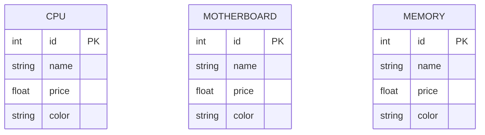
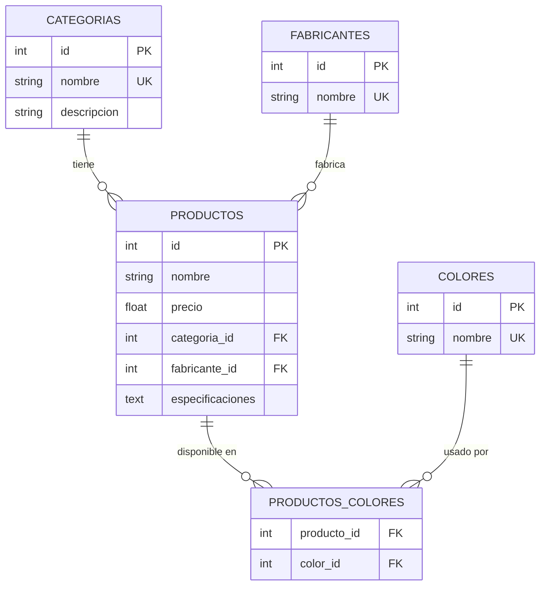
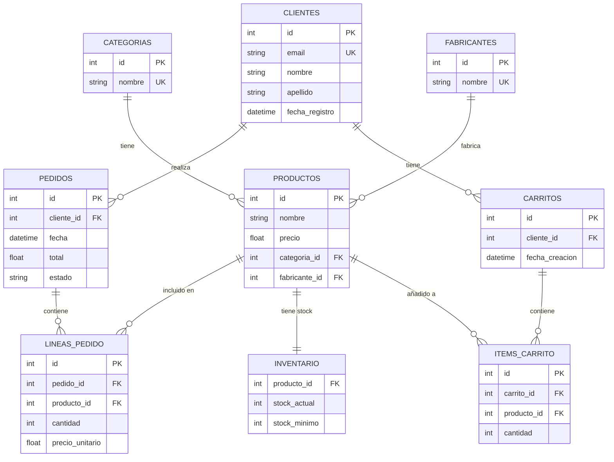

# 📝 Ejercicio 1.1: Introducción a SQLite - Cargar Datos desde CSV

> **📤 ¿Cómo entregar este ejercicio?** Lee las instrucciones completas aquí: [INSTRUCCIONES_ENTREGA.md](./INSTRUCCIONES_ENTREGA.md)

---

## 🎯 Objetivos de Aprendizaje

Al completar este ejercicio serás capaz de:

- ✅ Entender qué es SQLite y cuándo usarlo
- ✅ Cargar datos desde archivos CSV a una base de datos
- ✅ Crear tablas con diferentes estructuras (3 modelos)
- ✅ Comprender las diferencias entre modelos normalizados y desnormalizados
- ✅ Realizar consultas SQL básicas para verificar los datos
- ✅ Usar Python con SQLite mediante `sqlite3` y `pandas`

---

## 📚 Pre-requisitos

Antes de empezar, asegúrate de tener:

- ✅ Python 3.11+ instalado
- ✅ Pandas instalado (`pip install pandas`)
- ✅ PyCharm configurado
- ✅ Los archivos CSV en `~/datos/csv_tienda_informatica/`

---

## 🧩 Contexto del Ejercicio

Trabajarás con un dataset real: **catálogo de una tienda de componentes informáticos**.

### Dataset
- **26 archivos CSV** con diferentes tipos de componentes
- **Productos reales** con precios, especificaciones técnicas
- **Estructura variada** (cada CSV tiene columnas diferentes)

### Ejemplos de componentes:
- CPUs (AMD, Intel)
- Placas base (Motherboards)
- Memoria RAM
- Tarjetas gráficas
- Monitores, teclados, ratones
- Y 20 categorías más...

---

## 📋 Enunciado del Ejercicio

Debes crear **3 bases de datos SQLite diferentes**, cada una implementando un modelo de datos distinto:

### **Modelo A: Catálogo Simple** (Desnormalizado)
Carga cada CSV directamente como una tabla independiente. 26 CSV = 26 tablas.

**Archivo resultado:** `tienda_modelo_a.db`

---

### **Modelo B: Normalizado** (3NF)
Diseña un esquema normalizado con:
- Tabla `categorias`
- Tabla `fabricantes`
- Tabla `productos` (con FK a categorias y fabricantes)
- Tabla `colores`
- Tabla `productos_colores` (relación muchos-a-muchos)

**Archivo resultado:** `tienda_modelo_b.db`

---

### **Modelo C: E-Commerce Completo**
Todo lo del Modelo B, más:
- Tabla `clientes`
- Tabla `pedidos`
- Tabla `lineas_pedido`
- Tabla `carritos`
- Tabla `items_carrito`
- Tabla `inventario`

**Archivo resultado:** `tienda_modelo_c.db`

---

## 🔧 Tareas a Realizar

### **Fase 0: Análisis Exploratorio de Datos (EDA)** 🔍

**⚠️ IMPORTANTE:** Antes de implementar cualquier modelo, debes **explorar y entender los datos**. No puedes diseñar una base de datos sin saber qué contiene.

Esta fase es **obligatoria** y fundamental para el resto del ejercicio.

---

#### **Parte 0.1: Script de Análisis Exploratorio**

**Crear:** `eda_exploratorio.py`

Este script debe realizar un análisis completo de todos los CSVs y generar estadísticas que te ayuden a entender la estructura de los datos.

**Requisitos del script:**

1. **Análisis por archivo CSV:**
   - Nombre del archivo
   - Número de filas y columnas
   - Nombres de columnas y sus tipos de datos
   - Primeras 3 filas de ejemplo

2. **Análisis de calidad de datos:**
   - Valores nulos por columna (cantidad y porcentaje)
   - Filas duplicadas (completas)
   - Rangos de valores numéricos (min, max, promedio para precios)
   - Valores únicos en columnas categóricas

3. **Análisis de patrones:**
   - Extraer fabricantes únicos de los nombres de productos
   - Extraer colores disponibles (si existe columna color)
   - Identificar columnas comunes entre todos los CSVs
   - Detectar categorías (basado en nombres de archivos)

4. **Salida:**
   - Imprimir reporte en consola
   - Guardar resumen en archivo `resumen_eda.md` (formato Markdown)

**Estructura esperada del script:**

```python
import pandas as pd
import glob
import os

def analizar_csv(ruta_csv):
    """Analiza un archivo CSV y retorna estadísticas"""
    # Tu código aquí
    pass

def extraer_fabricantes(dataframe, columna_nombre='name'):
    """Extrae fabricantes únicos del nombre del producto"""
    # Tu código aquí
    pass

def analizar_calidad_datos(dataframe):
    """Analiza valores nulos, duplicados, rangos"""
    # Tu código aquí
    pass

def generar_reporte_completo(ruta_carpeta_csv):
    """Genera reporte completo de todos los CSVs"""
    # Tu código aquí
    pass

if __name__ == "__main__":
    ruta_datos = "../../datos/csv_tienda_informatica/csv_tienda_informatica/"
    generar_reporte_completo(ruta_datos)
```

---

#### **Parte 0.2: Documento de Análisis**

**Crear:** `ANALISIS_DATOS.md`

Basado en lo que descubriste con el script EDA, documenta tus hallazgos:

**Secciones obligatorias:**

1. **Resumen Ejecutivo**
   - ¿Cuántos archivos CSV hay?
   - ¿Cuántos productos totales aproximadamente?
   - ¿Cuántas categorías diferentes?

2. **Análisis de Estructura**
   - ¿Qué columnas son comunes a todos los CSVs?
   - ¿Qué columnas son específicas de ciertas categorías?
   - Tabla resumen: nombre archivo → número de filas

3. **Análisis de Calidad**
   - ¿Hay valores nulos? ¿Dónde y cuántos?
   - ¿Hay duplicados?
   - ¿Los precios tienen sentido? (no negativos, rangos razonables)

4. **Identificación de Entidades**
   - Lista de fabricantes únicos encontrados
   - Lista de colores únicos (si aplica)
   - Lista de categorías (nombres de archivos)

5. **Conclusiones para el Diseño**
   - ¿Qué entidades identificas para el Modelo B?
   - ¿Qué relaciones existen entre las entidades?
   - Justifica por qué el Modelo A es simple pero ineficiente

---

#### **Parte 0.3: Diagramas Entidad-Relación**

Dentro de `ANALISIS_DATOS.md`, incluye diagramas ER usando **Mermaid** (sintaxis markdown).

##### **Diagrama ER - Modelo A:**



**Descripción textual:**
- Modelo A es simplemente 26 tablas independientes
- Cada tabla replica la estructura de su CSV
- **Problema:** Mucha redundancia, sin relaciones

---

##### **Diagrama ER - Modelo B (Normalizado):**



**Descripción textual:**
- **Categorías:** Una fila por cada tipo (cpu, motherboard, etc.)
- **Fabricantes:** AMD, Intel, Corsair, etc. (sin duplicar)
- **Productos:** Todos los productos con FKs a categoría y fabricante
- **Relación M:N:** Un producto puede tener varios colores

---

##### **Diagrama ER - Modelo C (E-Commerce):**



**Descripción textual:**
- Todo lo del Modelo B +
- **Clientes:** Usuarios registrados
- **Pedidos:** Compras realizadas
- **Líneas de Pedido:** Detalle de productos en cada pedido
- **Inventario:** Control de stock por producto
- **Carritos:** Compras pendientes

---

#### **Entregables de la Fase 0:**

Antes de continuar con los modelos A, B y C, debes tener:

- ✅ `eda_exploratorio.py` - Script ejecutable que genera análisis completo
- ✅ `resumen_eda.md` - Salida del script con estadísticas (formato Markdown)
- ✅ `ANALISIS_DATOS.md` - Documento con hallazgos, diagramas ER y conclusiones

**⏱️ Tiempo estimado:** 2-3 horas

**🎯 Objetivo:** Que entiendas los datos **antes** de diseñar las bases de datos. Los diagramas ER te servirán como "plano" para implementar los modelos.

---

### Parte 1: Modelo A - Catálogo Simple

1. **Crear script Python:** `solucion_modelo_a.py`
2. **Funcionalidad:**
   - Leer todos los CSV de la carpeta
   - Crear una tabla por cada CSV
   - Insertar datos tal cual vienen
3. **Resultado:**
   - Base de datos `tienda_modelo_a.db` con 26 tablas

**Pista:** Usa `pandas.read_csv()` y `DataFrame.to_sql()`

---

### Parte 2: Modelo B - Normalizado

1. **Crear script Python:** `solucion_modelo_b.py`
2. **Funcionalidad:**
   - Crear tablas normalizadas
   - Extraer fabricantes únicos de todos los CSVs
   - Extraer colores únicos
   - Crear categorías basadas en nombres de archivos
   - Insertar productos con Foreign Keys correctas
3. **Resultado:**
   - Base de datos `tienda_modelo_b.db` con ~8 tablas relacionadas

**Pista:** Necesitarás parsear nombres de productos para extraer fabricantes

---

### Parte 3: Modelo C - E-Commerce Completo

1. **Crear script Python:** `solucion_modelo_c.py`
2. **Funcionalidad:**
   - Todo lo del Modelo B
   - Crear tablas adicionales de clientes, pedidos, inventario
   - Generar datos de ejemplo (3-5 clientes ficticios)
   - Generar 2-3 pedidos de ejemplo
   - Inicializar inventario con stock aleatorio (50-200 unidades)
3. **Resultado:**
   - Base de datos `tienda_modelo_c.db` con ~15 tablas

---

### Parte 4: Consultas de Verificación

Crea un archivo `consultas_verificacion.sql` con queries para cada modelo:

#### Para Modelo A:
```sql
-- ¿Cuántas CPUs hay en el catálogo?
-- ¿Cuál es el precio promedio de las placas base?
-- Top 5 tarjetas gráficas más caras
```

#### Para Modelo B:
```sql
-- ¿Cuántos productos hay por categoría?
-- ¿Qué fabricantes tienen más productos?
-- Productos con color "Black" de fabricante "Corsair"
```

#### Para Modelo C:
```sql
-- ¿Cuántos pedidos tiene cada cliente?
-- ¿Cuál es el total de ventas por categoría?
-- Productos con stock bajo (< stock_mínimo)
```

---

### Parte 5: Documento de Reflexión

Crea `REFLEXION.md` respondiendo:

1. **¿Cuál modelo fue más fácil de implementar? ¿Por qué?**
2. **¿Qué ventajas encontraste en el Modelo A?**
3. **¿Qué desventajas encontraste en el Modelo A?**
4. **¿En qué situación usarías el Modelo B sobre el A?**
5. **¿El Modelo C es necesario para todos los casos? Justifica.**
6. **¿Qué pasaría si quisieras agregar una nueva columna "descuento" a todos los productos?**
   - En Modelo A: ¿Cuántas tablas modificarías?
   - En Modelo B: ¿Cuántas tablas modificarías?

---

## 📦 Estructura de Entrega

Tu carpeta `1.1_introduccion_sqlite/` debe contener:

```
1.1_introduccion_sqlite/
├── eda_exploratorio.py          # [FASE 0] Script de análisis exploratorio
├── resumen_eda.md               # [FASE 0] Salida del script EDA (Markdown)
├── ANALISIS_DATOS.md            # [FASE 0] Documento con hallazgos y diagramas ER
├── solucion_modelo_a.py         # [PARTE 1] Script Modelo A
├── solucion_modelo_b.py         # [PARTE 2] Script Modelo B
├── solucion_modelo_c.py         # [PARTE 3] Script Modelo C
├── consultas_verificacion.sql   # [PARTE 4] Queries de prueba
├── REFLEXION.md                 # [PARTE 5] Respuestas a preguntas
├── tienda_modelo_a.db           # BD generada (gitignore)
├── tienda_modelo_b.db           # BD generada (gitignore)
└── tienda_modelo_c.db           # BD generada (gitignore)
```

**Nota:** Los archivos `.db` NO se suben a GitHub (están en `.gitignore`)

---

## 🎓 Criterios de Evaluación

| Criterio | Peso | Qué se evalúa |
|----------|------|---------------|
| **Fase 0: EDA** | 15% | Script EDA ejecuta correctamente, `ANALISIS_DATOS.md` completo con diagramas ER, análisis de calidad de datos |
| **Funcionalidad** | 35% | Los 3 scripts generan las BDs correctamente, datos se cargan sin errores |
| **Diseño del Esquema** | 25% | Modelo B y C tienen estructura correcta, FKs bien definidas, normalización adecuada |
| **Código** | 15% | Limpio, comentado, buenas prácticas, manejo de errores |
| **Reflexión** | 10% | Respuestas demuestran comprensión de trade-offs entre modelos |

---

## 💡 Pistas y Consejos

### Para Modelo A:
```python
import pandas as pd
import sqlite3

# Listar todos los CSV
csv_files = glob.glob("ruta/*.csv")

# Por cada CSV:
for csv_file in csv_files:
    df = pd.read_csv(csv_file)
    nombre_tabla = extraer_nombre(csv_file)
    df.to_sql(nombre_tabla, conn, if_exists="replace")
```

### Para Modelo B:
```python
# Extraer fabricantes únicos de todos los productos
all_manufacturers = set()
for csv_file in csv_files:
    df = pd.read_csv(csv_file)
    # Parsear 'name' para extraer fabricante
    manufacturers = df['name'].str.split().str[0]
    all_manufacturers.update(manufacturers)

# Insertar en tabla fabricantes
for mfr in all_manufacturers:
    cursor.execute("INSERT INTO fabricantes (nombre) VALUES (?)", (mfr,))
```

### Para Modelo C:
```python
# Generar clientes ficticios
clientes = [
    ("juan@email.com", "Juan", "Pérez"),
    ("maria@email.com", "María", "López"),
]

for email, nombre, apellido in clientes:
    cursor.execute("""
        INSERT INTO clientes (email, nombre, apellido)
        VALUES (?, ?, ?)
    """, (email, nombre, apellido))
```

---

## 📚 Recursos de Apoyo

### Documentación:
- [SQLite Official Docs](https://www.sqlite.org/docs.html)
- [Python sqlite3 module](https://docs.python.org/3/library/sqlite3.html)
- [Pandas to_sql](https://pandas.pydata.org/docs/reference/api/pandas.DataFrame.to_sql.html)

### Lecturas complementarias:
- Ver `TEORIA.md` en esta carpeta
- Ver `../MODELOS_DE_DATOS.md` para diagramas completos

---

## ❓ Preguntas Frecuentes

**P: ¿Puedo usar SQLAlchemy en lugar de sqlite3?**
R: Sí, pero para este ejercicio sqlite3 nativo es más didáctico.

**P: ¿Debo limpiar los datos (valores nulos, etc.)?**
R: Para este ejercicio no es necesario, enfócate en la estructura.

**P: ¿Los nombres de columnas deben ser exactamente como en el CSV?**
R: En Modelo A sí. En Modelo B y C puedes normalizarlos.

**P: ¿Cómo extraigo el fabricante del nombre del producto?**
R: Generalmente es la primera palabra: "AMD Ryzen..." → "AMD"

**P: ¿El inventario inicial debe ser real?**
R: No, usa números aleatorios entre 50-200 unidades.

---

## 🚀 Desafíos Extra (Opcional)

Si terminas antes y quieres más práctica:

1. **Agregar validaciones:**
   - Precio > 0
   - Stock >= 0
   - Email válido en clientes

2. **Crear vistas SQL:**
   - Vista con productos + categoría + fabricante (Modelo B)
   - Vista con total de ventas por cliente (Modelo C)

3. **Índices:**
   - Agregar índices a FKs para mejorar performance
   - Índice en precio para búsquedas rápidas

4. **Triggers:**
   - Trigger que actualiza inventario al crear pedido
   - Trigger que valida stock antes de insertar en carrito

---

## ✅ Checklist de Completitud

Antes de dar por terminado el ejercicio, verifica:

### Fase 0: Análisis Exploratorio
- [ ] `eda_exploratorio.py` ejecuta sin errores
- [ ] `resumen_eda.md` se genera correctamente con estadísticas en formato Markdown
- [ ] `ANALISIS_DATOS.md` está completo con todas las secciones:
  - [ ] Resumen Ejecutivo con estadísticas
  - [ ] Análisis de Estructura (columnas comunes, tabla resumen)
  - [ ] Análisis de Calidad (nulos, duplicados, rangos)
  - [ ] Identificación de Entidades (categorías, fabricantes, colores)
  - [ ] Diagramas ER (Modelo A, B y C) en formato Mermaid
  - [ ] Conclusiones para el Diseño

### Partes 1-3: Implementación de Modelos
- [ ] `solucion_modelo_a.py` funciona y genera `tienda_modelo_a.db`
- [ ] `solucion_modelo_b.py` funciona y genera `tienda_modelo_b.db`
- [ ] `solucion_modelo_c.py` funciona y genera `tienda_modelo_c.db`
- [ ] Las 3 bases de datos se pueden abrir con DB Browser for SQLite

### Parte 4: Consultas de Verificación
- [ ] `consultas_verificacion.sql` tiene al menos 3 queries por modelo
- [ ] Todas las queries ejecutan sin errores

### Parte 5: Reflexión
- [ ] `REFLEXION.md` tiene respuestas completas a las 6 preguntas

### General
- [ ] El código está comentado y es legible
- [ ] No hay archivos `.db` en el repositorio Git
- [ ] Los diagramas ER se visualizan correctamente en GitHub

---

**¡Mucha suerte!** 🚀

Recuerda: El objetivo no es solo que funcione, sino que **entiendas** las diferencias entre los modelos.

---

**Creado:** 2025-12-11
**Última actualización:** 2025-12-15 (Agregada Fase 0: EDA)
**Duración estimada:** 8-10 horas (2-3h Fase 0 + 6-7h Implementación)
**Nivel:** Básico-Intermedio
